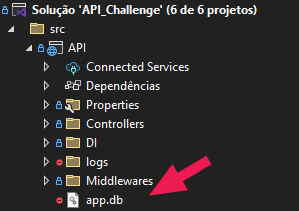
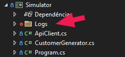

# RIA - Software Engineer Coding test

## Denomination routine

The `DenominationRoutine_Challenge` project aims to calculate and display all possible combinations of banknotes to pay specific amounts, using only the available denominations (100, 50, and 10 euros). The main features are:

- **Definition of Denominations and Values:**

    The [cartridges](https://github.com/Victoralm/RIA_Software-Engineer-Coding-test/blob/a2f0c987cacb786e8da891ed690b1fdf57d35e77/DenominationRoutine_Challenge/Program.cs#L3) array defines the available banknotes, while the [payouts](https://github.com/Victoralm/RIA_Software-Engineer-Coding-test/blob/a2f0c987cacb786e8da891ed690b1fdf57d35e77/DenominationRoutine_Challenge/Program.cs#L4) array lists the amounts to be paid.

- **Combination Calculation:**

    The [DenominationEngine](https://github.com/Victoralm/RIA_Software-Engineer-Coding-test/blob/a2f0c987cacb786e8da891ed690b1fdf57d35e77/DenominationRoutine_Challenge/Program.cs#L27) class receives the denominations and, through the `Enumerate` method, generates all possible combinations of banknotes for a requested amount.

- **Combination Representation:**

    The [NotePack](https://github.com/Victoralm/RIA_Software-Engineer-Coding-test/blob/a2f0c987cacb786e8da891ed690b1fdf57d35e77/DenominationRoutine_Challenge/Program.cs#L15) struct represents a combination of banknotes, with an overridden [ToString](https://github.com/Victoralm/RIA_Software-Engineer-Coding-test/blob/a2f0c987cacb786e8da891ed690b1fdf57d35e77/DenominationRoutine_Challenge/Program.cs#L17) method to display the result in a readable format.

- **Result Display:**

    For each value in `payouts`, the program prints all possible combinations of banknotes.

### Applied Patterns

- **Immutability:**

    The `NotePack` struct is `readonly`, ensuring its properties cannot be changed after creation.

- **Record Struct:**

    Use of `record struct` simplifies the creation of immutable value types with structural comparison.

- **Iterator (yield return):**

    The [Enumerate](https://github.com/Victoralm/RIA_Software-Engineer-Coding-test/blob/a2f0c987cacb786e8da891ed690b1fdf57d35e77/DenominationRoutine_Challenge/Program.cs#L29) method uses [yield return](https://github.com/Victoralm/RIA_Software-Engineer-Coding-test/blob/a2f0c987cacb786e8da891ed690b1fdf57d35e77/DenominationRoutine_Challenge/Program.cs#L39) to generate combinations on demand, optimizing memory and performance.

- **Algorithmic Simplicity:**

    Since there are only three denominations, the algorithm uses nested loops, making the code more straightforward and efficient.

## REST API

### Executing the projects

The project already has a profile to run the API and the Simulator together:

### Database and Logs

Note that the **SQLite database** and the **logs** directory will be created automatically when the project `API` starts for the first time:

The **Logs** directory will also be created automatically when the project `Simulator` starts for the first time:

### Chalange Features

1. [Endpoints](API_Challenge/API/Controllers/CustomerController.cs)

   1. **GET**: Where the custom ordering ([OrderByName](https://github.com/Victoralm/RIA_Software-Engineer-Coding-test/blob/a2f0c987cacb786e8da891ed690b1fdf57d35e77/API_Challenge/Domain/Entities/Customer.cs#L10)) are used. Implementing a MergeSort algorithm in order to keep a quasilinear (O(n log n)) complexity. It was placed at the Domain class in order to simulate a real world Business Logic relative to that domain:

      - **Specific Business Logic:**

        Sorting customers by last name and first name can be a relevant business rule for the domain, for example, to display customer lists in reports, admin screens, or official documents.

      - **Encapsulation of Domain Rules:**

        By placing the sorting logic inside the domain entity itself, we centralize and make explicit that this is the "official" way to sort customers in the business context.

      - **Adherence to DDD:**

        In DDD (Domain-Driven Design), it is common to encapsulate behaviors and rules that make sense for the domain directly within entities or aggregates, making the domain more expressive and less dependent on external utilities.

   2. **POST**: The Post method implements a batch customer registration flow, using patterns such as CQRS, MediatR, Repository, and automatic validation. Ensuring decoupling, testability, and clear separation of responsibilities.

       - **MediatR (CQRS)**:

           - The command is sent to MediatR (`_mediator.Send(command)`), which forwards it to the handler responsible for the batch registration logic.

       - **Validation**:

           - Before executing the handler, MediatR's pipeline uses FluentValidation to validate each customer in the list. Ensuring all required fields are correct and there are no duplicate IDs.

       - **Persistence**:

           - The handler converts the commands into Customer entities and uses the repository to save the data to the database.

       - **Error Handling**:

           - Validation: Returns 400 Bad Request with details of validation errors.

           - Duplicates: Returns 400 Bad Request if there is an attempt to insert an already existing ID.

           - Internal Error: Returns 500 Internal Server Error for unhandled exceptions. Preventing key information to be exposed by the API.

2. [Simulator](API_Challenge/Simulator/Program.cs)

    The Simulator project automates the generation and sending of customer data to the API, testing its behavior under load and concurrency, using best practices such as abstraction, DTOs, logging, and parallelism.

    - **Wait for API Availability:**

        Before starting, the project waits for the API to become available, making connection attempts until successful.

    - **Customer Data Generation:**

        Uses the [CustomerGenerator](API_Challenge/Simulator/CustomerGenerator.cs) class to create fictitious customers with varied data (first name, last name, age, id).

    - **Parallel Request Sending:**

        Performs multiple POST requests (for customer registration) and GET requests (to retrieve all customers) in parallel, simulating concurrent API usage.

    - **Parallelism/Concurrency:**

        Uses [Task.Run](https://github.com/Victoralm/RIA_Software-Engineer-Coding-test/blob/a2f0c987cacb786e8da891ed690b1fdf57d35e77/API_Challenge/Simulator/Program.cs#L59) and [Task.WhenAll](https://github.com/Victoralm/RIA_Software-Engineer-Coding-test/blob/a2f0c987cacb786e8da891ed690b1fdf57d35e77/API_Challenge/Simulator/Program.cs#L88) to execute multiple operations simultaneously, simulating real-world load scenarios.

    - **Centralized Log Recording:**

        Uses Serilog to log all operations, errors, and responses, both to the console and to a file.

    - **DTO (Data Transfer Object):**

        Uses [CustomerDto](https://github.com/Victoralm/RIA_Software-Engineer-Coding-test/blob/a2f0c987cacb786e8da891ed690b1fdf57d35e77/API_Challenge/Simulator/CustomerGenerator.cs#L41) to transfer data between the simulator and the API, decoupling the domain model from transport.

    - **Client Abstraction:**

        The [ApiClient](API_Challenge/Simulator/ApiClient.cs) class encapsulates the HTTP communication logic with the API, centralizing access and simplifying maintenance.

### Extras

    
Collapse

Out of the scope of the challenge, the solution also implements:

- **Unit Tests**:

  Used during the development process.

- **Middlewares**:

  To log the performance and possible unhandled exceptions.

### Clean Architecture Pattern

    
Collapse

1. Layer Separation

    - **Domain**: Contains the core business entities (e.g., [Customer](API_Challenge/Domain/Entities/Customer.cs)), with no external dependencies.

    - **Application**: Defines repository interfaces (e.g., [ICustomerRepository](API_Challenge/Application/Repositories/Interfaces/ICustomerRepository.cs)), validators, handlers, and application logic. Depends only on the Domain layer.

    - **Infrastructure**: Implements repository interfaces (e.g., [CustomerRepository](API_Challenge/Infrastructure/Repositories/Implementations/CustomerRepository.cs)), database context ([AppDbContext](API_Challenge/Infrastructure/Context/AppDbContext.cs)), and possible external integrations. Depends on Application and Domain, but not vice versa.

    - **API**: Presentation layer responsible for controllers (e.g., [CustomerController](API_Challenge/API/Controllers/CustomerController.cs)), middlewares, and service configuration. Depends on other layers, but is not depended upon by them.

2. Dependency Inversion

    - Dependencies are injected via interfaces (e.g., `ICustomerRepository`), with concrete implementations in the Infrastructure layer.

    - The Application layer depends only on abstractions, not on concrete implementations.

3. Framework Independence

    - The use of frameworks (EF Core, Serilog, FluentValidation, MediatR) is restricted to the appropriate layers (mainly Infrastructure and Application), without polluting the Domain layer.

4. Dependency Injection Configuration

    - Each layer exposes extension methods to register its own services, keeping the configuration modular and aligned with Clean Architecture principles.

### CQRS Pattern

    
Collapse

1. Separation of Commands and Queries

    - Commands (write operations):
       - [CustomerBulkPostCommand](https://github.com/Victoralm/RIA_Software-Engineer-Coding-test/blob/cb4252e22f76b350e264aeb603fb028f943a4f28/API_Challenge/Application/Handlers/CustomerPostCommandHandler.cs#L7) and [CustomerPostCommand](https://github.com/Victoralm/RIA_Software-Engineer-Coding-test/blob/cb4252e22f76b350e264aeb603fb028f943a4f28/API_Challenge/Application/Handlers/CustomerPostCommandHandler.cs#L8) are used to create customers.
       - The handler [CustomerPostCommandHandler](API_Challenge/Application/Handlers/CustomerPostCommandHandler.cs) processes the write command.

    - Queries (read operations):
        - [CustomerGetQuery](https://github.com/Victoralm/RIA_Software-Engineer-Coding-test/blob/cb4252e22f76b350e264aeb603fb028f943a4f28/API_Challenge/Application/Handlers/CustomerGetQueryHandler.cs#L7) and [CustomerGetMaxIdQuery](https://github.com/Victoralm/RIA_Software-Engineer-Coding-test/blob/cb4252e22f76b350e264aeb603fb028f943a4f28/API_Challenge/Application/Handlers/CustomerGetMaxIdQueryHandler.cs#L6) are used to fetch data.
        - The handlers [CustomerGetQueryHandler](API_Challenge/Application/Handlers/CustomerGetQueryHandler.cs) and [CustomerGetMaxIdQueryHandler](API_Challenge/Application/Handlers/CustomerGetMaxIdQueryHandler.cs) process the queries.

2. Use of MediatR

    - All commands and queries are sent via MediatR ([ISender](https://github.com/Victoralm/RIA_Software-Engineer-Coding-test/blob/cb4252e22f76b350e264aeb603fb028f943a4f28/API_Challenge/API/Controllers/CustomerController.cs#L13)), promoting decoupling between the presentation layer (API) and business logic.

    - The controller does not know implementation details of the handlers, it only sends commands/queries.

3. Separate Validation

    - Specific validations for commands ([CustomerPostCommandValidator](API_Challenge/Application/Validators/CustomerPostCommandValidator.cs), [CustomerBulkPostCommandValidator](API_Challenge/Application/Validators/CustomerBulkPostCommandValidator.cs)) using FluentValidation.

    - The validation pipeline ([ValidationBehavior](API_Challenge/Application/Behaviors/ValidationBehavior.cs)) ensures that invalid commands are not processed.

4. Clear Responsibilities

    - Commands change the system state (inserting customers).

    - Queries only retrieve data, with no side effects.

### DDD Pattern

    
Collapse

1. Encapsulation of Behavior in the Domain

    - The [OrderByName](https://github.com/Victoralm/RIA_Software-Engineer-Coding-test/blob/a2f0c987cacb786e8da891ed690b1fdf57d35e77/API_Challenge/Domain/Entities/Customer.cs#L10) method was placed as a static method in the [Customer](API_Challenge/Domain/Entities/Customer.cs) entity, centralizing the sorting logic that is relevant to the customer domain.

    - This follows the DDD principle that behaviors and business rules meaningful to the domain should reside within the domain itself, not in generic utilities.

2. Expressiveness of the Model

    - By exposing `OrderByName` directly in `Customer`, the domain model becomes more expressive and self-explanatory: it is clear to any developer that sorting by name is an important business rule for customers. This was done in this way as a means to leverage a challenge-specific solution and bring it as an example of a real-world standardization case.

3. Isolation of Business Logic

    - The sorting logic is not scattered across other layers (Application, Infrastructure), but is instead centralized in the domain, making it easier to maintain and evolve the rule.

4. Adherence to DDD

    - In DDD, it is common for static or instance methods to encapsulate business rules related to the entity, even if they do not change its state.

    - The static method is appropriate here, as sorting is an operation over collections of customers, not on an individual customer.

5. Limitations and Considerations

    - If the sorting logic changes due to a future business rule (e.g., considering other fields or specific sorting rules), it will be centralized and easy to modify.

    - If the sorting is purely technical and has no business meaning, it could be kept outside the domain. But in this case, the choice is justifiable.

